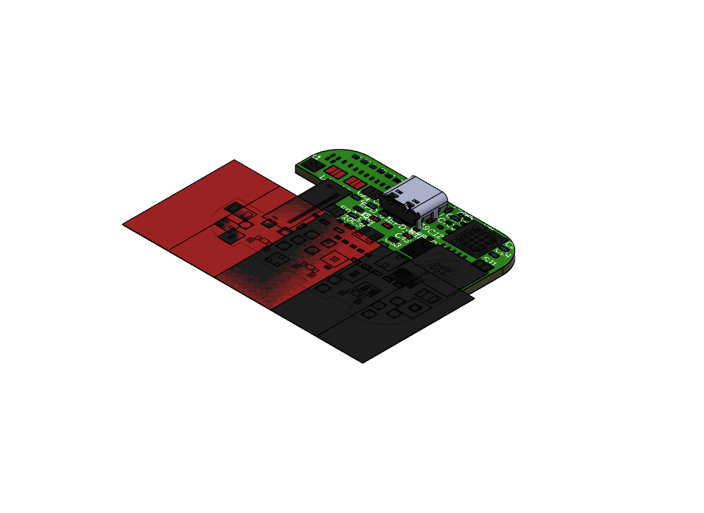
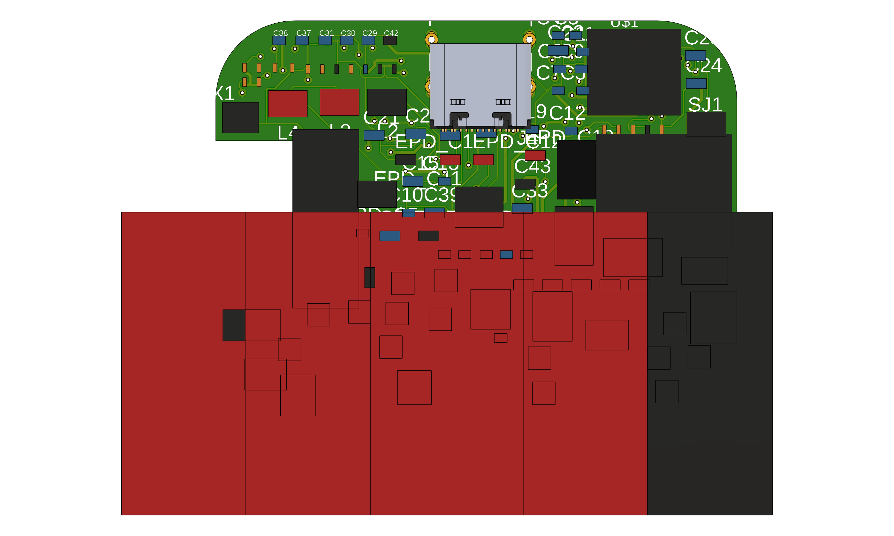
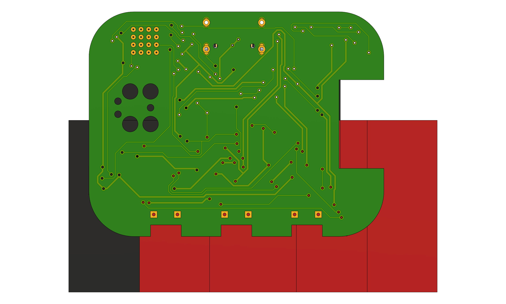

# InkTime

Open-source smartwatch hardware platform built around the **Nordic nRF52840**. The project integrates a **1.54" e-paper display**, **3-axis IMU**, **battery charger**, **fuel gauge**, **haptic feedback driver**, **USB-C connectivity**, and a compact Li-Po-powered form factor designed to fit the provided InkTime enclosure.

This repository contains the complete hardware design package for the InkTime board:
- native Fusion Electronics files (`.sch`, `.brd`)
- schematic PDF export
- manufacturing outputs (Gerbers, BOM, Pick and Place)
- 3D mechanical assembly (`.f3z`)
- PCB and assembly images

---

Quick links:
- [Schematic source](Hardware/SCHEMATIC.sch)
- [Board source](Hardware/PCB.brd)
- [Schematic PDF](Hardware/Schematic.pdf)
- [Manufacturing BOM](Manufacturing/BOM.xlsx)
- [Pick and Place](Manufacturing/PickAndPlace.mnt)
- [Gerbers](Manufacturing/Gerbers.zip)
- [Mechanical assembly](Mechanical/Electronics%20Design%20InkTime.f3z)

---

## PCB renders

### 3D PCB view


### Top layer


### Bottom layer


### Schematic overview


---

## Block diagram

```mermaid
flowchart LR
    USB[USB-C]
    BAT[Li-Po Battery\n3.7V / 250mAh]
    CHG[BQ25180\nCharger + Power Path]
    REG[RT6160A\nBuck-Boost 3.3V]
    MCU[nRF52840\nBLE MCU]
    IMU[BMA423\n3-axis accelerometer]
    FG[MAX17048\nFuel gauge]
    HAP[DRV2605\nHaptic driver]
    MOTOR[Vibration motor]
    EPDPWR[EPD drive circuit\nboost / analog rails]
    EPD[1.54" e-paper display]
    DBG[SWD test / debug pads]

    USB --> CHG
    BAT --> CHG
    BAT --> FG
    CHG --> REG
    REG --> MCU
    REG --> IMU
    REG --> HAP
    REG --> EPDPWR
    MCU <--> IMU
    MCU <--> FG
    MCU <--> HAP
    HAP --> MOTOR
    MCU --> EPD
    EPDPWR --> EPD
    MCU --> DBG
```

---

## Hardware overview

### 1) Main MCU and wireless subsystem
The central controller is the **nRF52840**, a BLE-capable SoC that handles the smartwatch logic, display updates, USB connectivity, sensor communication, battery monitoring, and haptic control. A **32 MHz high-frequency crystal** is used for the RF subsystem and a **32.768 kHz crystal** is used for low-power timing.

The RF path uses a **Johanson 2.4 GHz chip antenna** matched through a compact network placed near the PCB edge. The board outline includes a dedicated antenna area so the radiating element sits toward the exterior of the device.

### 2) Power architecture
The board is powered from a **single-cell Li-Po battery** and can also be powered/charged from **USB-C VBUS**.

Power is split into two main stages:
1. **BQ25180** handles battery charging, power-path management, and system rail generation.
2. **RT6160A** generates the regulated **3.3 V rail** used by the digital domain.

This separates the battery domain from the regulated logic rail and makes it easier to power the watch both from battery and from USB while charging.

### 3) Display subsystem
The watch uses a **1.54" black/white e-paper display (200x200)** connected through a **24-pin FPC connector**. The MCU communicates with the panel through an SPI-style interface (`CS`, `SCK`, `MOSI`, `DC`, `RST`, `BUSY`).

Because the raw panel requires multiple analog drive voltages, the design also includes a dedicated **e-paper drive circuit** with discrete inductors, MOSFETs, Schottky diodes, and high-voltage capacitors to generate the rails needed by the panel.

### 4) Motion sensing
Motion is provided by a **Bosch BMA423** low-power 3-axis accelerometer. It is connected over **I2C** and exposes **two interrupt lines** to the MCU. This allows the design to support low-power motion-based wakeups, gesture detection, activity recognition, or step-related features.

### 5) Battery monitoring
Battery state-of-charge monitoring is implemented with the **MAX17048** fuel gauge. It is connected to the battery rail and communicates with the MCU over **I2C**, with an additional **ALERT** interrupt line for battery threshold events.

### 6) Haptics
Haptic feedback is driven by a **DRV2605** haptic driver IC. This allows the MCU to trigger vibration effects without driving the motor directly from a GPIO. The driver is paired with a small **coin vibration motor**, which is more suitable for a watch form factor than a large ERM assembly.

### 7) User inputs
The board includes **three buttons**:
- `SW_UP`
- `SW_ENT`
- `SW_DN`

Each button is implemented as an active-low input with an RC network for stable input behavior.

### 8) USB and programming
A **USB-C receptacle** is included for charging and USB connectivity. The data lines are protected with a **USBLC6-2SC6Y** ESD array. Development and flashing are supported through a **Tag-Connect TC2030** debug connector and through several named test pads (`SWDIO`, `SWDCLK`, `SWO`, `RESET`, `3V3`, `GND`, etc.).

---

## Detailed nRF52840 pin usage

The table below summarizes the intended signal allocation of the nRF52840 in this design.

| nRF52840 pin | Signal / function | Connected block | Why this pin is used |
|---|---|---|---|
| `P0.06` | `SDA` | PMIC / IMU / fuel gauge / haptic control bus | Shared I2C data line keeps the peripheral interface compact |
| `P0.07` | `SCL` | PMIC / IMU / fuel gauge / haptic control bus | Shared I2C clock line |
| `P0.11` | `PMIC_INT` | BQ25180 | Interrupt from charger / power-path IC |
| `P0.10` | `ALERT` | MAX17048 | Battery alert / threshold interrupt |
| `P0.08` | `IMU_INT1` | BMA423 | Primary motion interrupt |
| `P1.08` | `IMU_INT2` | BMA423 | Secondary motion interrupt |
| `P0.12` | `HAPTIC_EN` | DRV2605 | Enables haptic driver |
| `P0.13` | `BTN_UP` | `SW_UP` | User input |
| `P0.14` | `BTN_ENTER` | `SW_ENT` | User input |
| `P1.02` | `BTN_DOWN` | `SW_DN` | User input |
| `P0.05` | `EPD_CS` | E-paper display | SPI chip-select for the display |
| `P0.02` | `EPD_SCK` | E-paper display | SPI clock |
| `P0.03` | `EPD_MOSI` | E-paper display | SPI data out to panel |
| `P0.15` | `EPD_DC` | E-paper display | Data/command select |
| `P0.16` | `EPD_RST` | E-paper display | Hardware reset for the panel |
| `P0.17` | `EPD_BUSY` | E-paper display | Busy feedback from the panel |
| `D+` | `USB_D+` | USB-C | Native USB interface of the nRF52840 |
| `D-` | `USB_D-` | USB-C | Native USB interface of the nRF52840 |
| `P0.18/RESET` | `RESET` | Debug / test | Hardware reset access |
| `SWDIO` | `SWDIO` | Tag-Connect + test pad | Programming and debugging |
| `SWDCLK` | `SWDCLK` | Tag-Connect + test pad | Programming and debugging |
| `P1.00` | `SWO` | Test pad | Optional trace / debug output |
| `P0.00`, `P0.01` | `XL1`, `XL2` | 32.768 kHz crystal | Low-power timing reference |

### Notes on the allocation
- The **I2C bus** is shared to minimize pin usage and routing complexity.
- The **display** is placed on a dedicated SPI-style interface because refreshing an e-paper panel is more suitable over a serial display bus than over I2C.
- **USB D+ / D-** are kept on the native USB pins of the nRF52840 to allow direct device connectivity.
- Motion, charging and battery monitoring all expose **interrupts**, which helps reduce polling and improves low-power operation.

---

## BOM summary

A full manufacturing BOM is available in [Manufacturing/BOM.xlsx](Manufacturing/BOM.xlsx). The table below lists the main functional components used in the project.

| Block | Part | Qty. | Role in design | Procurement | Datasheet |
|---|---:|---:|---|---|---|
| MCU + BLE | Nordic **nRF52840-QIAA** | 1 | Main MCU, BLE, USB, sensor/display control | https://www.lcsc.com/product-detail/C190794.html | https://docs.nordicsemi.com/bundle/nRF52840_PS_v1.9/resource/nRF52840_PS_v1.9.pdf |
| Charger / power path | TI **BQ25180** | 1 | Li-Po charger and system power-path management | https://www.ti.com/product/BQ25180 | https://www.ti.com/lit/gpn/BQ25180 |
| 3.3 V regulator | Richtek **RT6160AWSC** | 1 | Buck-boost regulator for the main logic rail | https://www.lcsc.com/product-detail/C7065276.html | https://www.richtek.com/assets/product_file/RT6160A/DS6160A-05.pdf |
| IMU | Bosch **BMA423** | 1 | Motion sensing and interrupts | https://www.lcsc.com/product-detail/C189517.html | https://www.lcsc.com/product-detail/C189517.html |
| Fuel gauge | Maxim / ADI **MAX17048G+T10** | 1 | Battery state-of-charge estimation | https://www.lcsc.com/product-detail/C2682616.html | https://www.analog.com/media/en/technical-documentation/data-sheets/max17048-max17049.pdf |
| Haptic driver | TI **DRV2605YZFR** | 1 | Drives vibration motor with dedicated haptic control | https://www.lcsc.com/product-detail/C81079.html | https://www.ti.com/lit/ds/symlink/drv2605.pdf |
| RF antenna | Johanson **2450AT18B100E** | 1 | 2.4 GHz chip antenna for BLE radio | https://www.lcsc.com/product-detail/C2917717.html | https://www.johansontechnology.com/docs/1187/2450AT18B100_X8XXogU.pdf |
| E-paper panel | Waveshare **WSH-12561 / 1.54" e-paper V2** | 1 | Main low-power display, 200x200, B/W | https://www.tme.eu/en/details/wsh-12561/e-paper/waveshare/12561/ | https://www.tme.eu/Document/0ca57a8ffbcd57b5bca53252eb9d6ec3/WSH-12561.pdf |
| Li-Po battery | Akyga **LP502030 / AKY0106** | 1 | Main energy source, 3.7 V / 250 mAh | https://www.tme.eu/ng/en/details/aky-lp502030/rechargeable-batteries/akyga-battery/aky0106/ | https://www.tme.eu/Document/b9e12bf26ad0ba929a22ab5d58f022cd/AKY0106.pdf |
| Haptic actuator | DFRobot **FIT0774** | 1 | Coin vibration motor | https://www.tme.eu/en/details/df-fit0774/dc-motors/dfrobot/fit0774/ | https://www.tme.eu/en/details/df-fit0774/dc-motors/dfrobot/fit0774/ |
| USB-C connector | kinghelm **KH-TYPE-C-16P** | 1 | Charging + USB interface | https://www.lcsc.com/product-detail/C709357.html | https://datasheet.lcsc.com/lcsc/2404191039_Shenzhen-Kinghelm-Elec-KH-TYPE-C-16P_C709357.pdf |
| E-paper FPC connector | Molex **503480-2400** | 1 | 24-pin display flex connector | https://www.molex.com/en-us/products/part-detail/5034802400 | https://www.molex.com/en-us/products/part-detail/5034802400 |
| ESD protection | ST **USBLC6-2SC6Y** | 1 | Protects VBUS / USB data lines | https://www.st.com/en/protections-and-emi-filters/usblc6-2sc6y.html | https://www.st.com/resource/en/datasheet/usblc6-2sc6y.pdf |
| Debug connector | Tag-Connect **TC2030-IDC** | 1 | Programming and SWD debugging | https://www.tag-connect.com/product/tc2030-idc-nl | https://www.tag-connect.com/wp-content/uploads/bsk-pdf-manager/TC2030-IDC-NL.pdf |
| Passive support network | 0201 / 0402 Rs, Cs, inductors, diodes, MOSFETs | multiple | Decoupling, matching, EPD drive, filters, pull-ups, button conditioning | see [Manufacturing/BOM.xlsx](Manufacturing/BOM.xlsx) | see [Manufacturing/BOM.xlsx](Manufacturing/BOM.xlsx) |

---

## Important design and layout decisions

### Compact watch-oriented form factor
The board outline is constrained by the enclosure and side-button alignment. From the native PCB file, the board fits in an approximately **46 mm × 35 mm** envelope, with additional notches / rounded corners required by the case geometry.

### Top-side component placement
All mounted components are placed on the **TOP layer**, while routing uses both copper layers. This follows the project recommendations and simplifies mechanical integration into the enclosure.

### Antenna placement
The chip antenna is placed at the PCB edge and kept away from large copper regions. This is important for BLE performance and also follows the course constraint that the antenna area should be kept clear.

### Separated power domains
The design separates:
- `VBUS` from USB-C
- `VBAT` from the battery
- regulated digital `3V3`
- dedicated e-paper analog drive rails

This makes the design more robust than powering the entire system directly from the battery rail.

### Testability
Dedicated test pads are provided for:
- battery rail and battery ground
- `3V3`
- `VREG`
- `SDA` / `SCL`
- `SWDIO` / `SWDCLK` / `SWO`
- `RESET`

These pads make bring-up and debugging much easier during EVT.

---

## Mechanical integration

The mechanical archive is available in:
- [Mechanical/Electronics Design InkTime.f3z](Mechanical/Electronics%20Design%20InkTime.f3z)

The design is intended to integrate:
- the PCB
- the Li-Po battery
- the e-paper display
- the vibration motor
- the enclosure

The physical locations of the **USB-C connector**, **display connector**, and **three side buttons** are all important because they are constrained by the enclosure openings and by the display stack-up.

---

## Manufacturing outputs

The repository already includes the standard fabrication outputs:
- [Gerber archive](Manufacturing/Gerbers.zip)
- [Bill of Materials](Manufacturing/BOM.xlsx)
- [Pick and Place](Manufacturing/PickAndPlace.mnt)

This makes the project ready for manufacturing review and assembly export.

---

## Implementation notes / design log

A few implementation aspects were especially important in this project:

1. **The e-paper display is the most demanding peripheral** from a power perspective because it needs more than a simple 3.3 V digital interface; the panel also requires dedicated analog drive rails.
2. **The RF section must be treated carefully** because the nRF52840 antenna matching network and chip antenna performance depend heavily on layout.
3. **Mechanical placement matters as much as the schematic** in a watch design. The USB connector, display FPC, and buttons cannot be placed arbitrarily.
4. **Battery monitoring and charging were intentionally separated from the main regulator** so the system can expose both battery information and a regulated logic rail.
5. **Debug access was preserved** through Tag-Connect and named test pads, which is very useful during bring-up and review.

---

## Files included in this repository

### Hardware
- `Hardware/SCHEMATIC.sch` — editable schematic source
- `Hardware/PCB.brd` — editable PCB source
- `Hardware/Schematic.pdf` — printable schematic export

### Manufacturing
- `Manufacturing/Gerbers.zip` — CAM output for fabrication
- `Manufacturing/BOM.csv`, `Manufacturing/BOM.xlsx` — parts list
- `Manufacturing/PickAndPlace.mnt` — placement export for assembly

### Mechanical
- `Mechanical/Electronics Design InkTime.f3z` — 3D assembly / Fusion archive

### Images
- PCB top / bottom captures
- schematic overview
- 3D PCB render

---

## Author

**Andrei-Alexandru Rusu**

InkTime hardware design repository for the TSC project.
